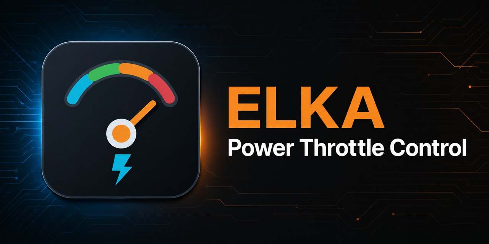

# ELKA Power Throttle Control



A focused Windows desktop application for managing per-application power throttling with Windows' built-in `powercfg` commands.

## Download

Download the current Windows installer or portable ZIP from the [Releases](https://github.com/torment78/ELKA.PowerThrottleControl/releases) page.

The installer is self-contained for 64-bit Windows; users do not need to install .NET separately.

## Features

- Discovers installed applications from machine-wide and per-user registry entries, App Paths, and Start Menu shortcuts.
- Select one or many executable-backed applications.
- Disable or enable power throttling through a visible elevated Command Prompt.
- Open Windows' authoritative `powercfg /powerthrottling list` output.
- Remembers the displayed application state between runs.
- A dedicated Network workspace detects running and installed VoiceMeeter, VBAN, Macro Buttons, Matrix, and Matrix Coconut executables (including 32-bit and 64-bit editions).
- Creates program-specific VBAN firewall rules on configurable UDP port 6980 by default, with selectable Private, Domain, and Public profiles.
- Offers a confirmed advanced full-traffic option, ELKA-rule removal, and an elevated authoritative rule list.
- Light, dark, and Windows-system themes.
- The main app runs normally; elevation is requested only for `powercfg` and firewall actions.

## Commands used

```text
powercfg /powerthrottling disable /path "<full executable path>"
powercfg /powerthrottling enable /path "<full executable path>"
powercfg /powerthrottling list
```

## Firewall commands

The Network workspace creates deterministic, removable rules using commands of this form:

```text
netsh advfirewall firewall add rule name="ELKA VBAN - <app> - In" dir=in action=allow program="<full executable path>" protocol=UDP localport=6980 profile=private enable=yes
netsh advfirewall firewall add rule name="ELKA VBAN - <app> - Out" dir=out action=allow program="<full executable path>" protocol=UDP remoteport=6980 profile=private enable=yes
```

The port and firewall profiles are configurable in the UI. VBAN uses UDP port 6980 by default according to the [official VoiceMeeter documentation](https://vb-audio.com/Voicemeeter/VoicemeeterBanana_UserManual.pdf).
## Build from source

Requirements:

- Windows 10 or later
- .NET 8 SDK
- Visual Studio 2022/Insider with the .NET desktop workload

Open `ELKA.PowerThrottleControl.sln` and press F5, or run:

```powershell
dotnet build ELKA.PowerThrottleControl.sln
```

To build the self-contained portable package and installer, install Inno Setup 6 and run:

```powershell
.\scripts\Build-Release.ps1 -Version 1.1.0
```

Outputs are written under `artifacts/installer`.

## State storage

Application state and theme preferences are stored per user under:

```text
%LOCALAPPDATA%\ELKA.PowerThrottleControl
```

## License

MIT. See [LICENSE](LICENSE).
